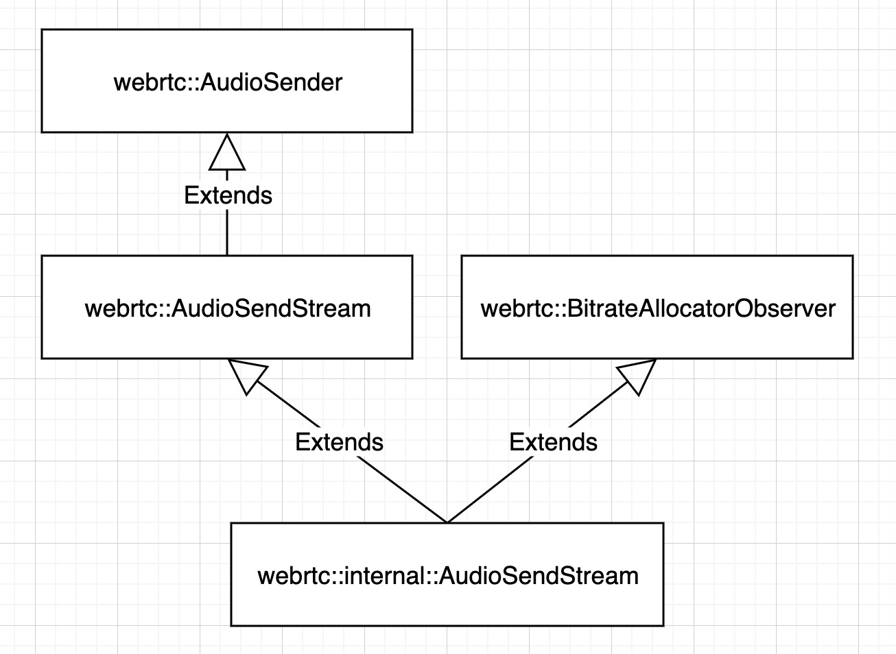
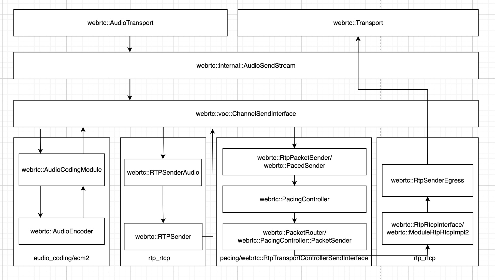
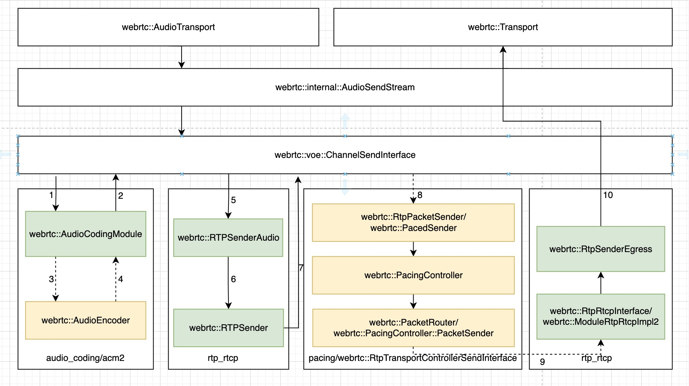
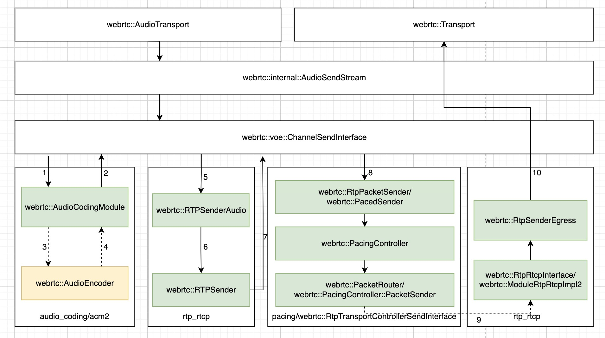
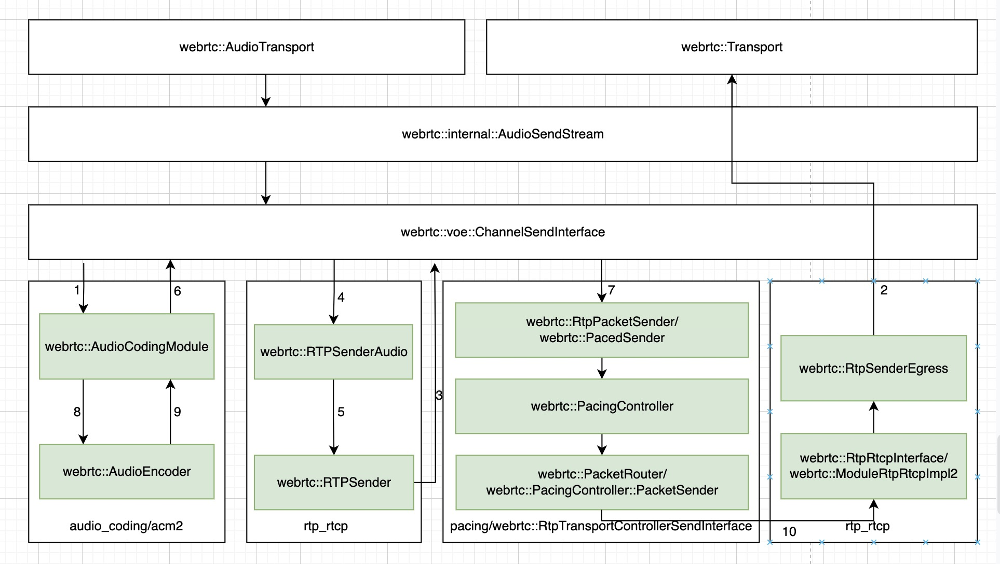

WebRTC 的音频数据处理发送的概念抽象层面的完整流程如下：
```
-----------------------------     --------------------------     ---------------------------
|                           |     |                        | ==> | webrtc::AudioProcessing |
| webrtc::AudioDeviceModule | ==> | webrtc::AudioTransport |     ---------------------------
|                           |     |                        |          ｜｜
-----------------------------     --------------------------          ｜｜
                                                                      ｜｜
                                          +=+=========================+=+
                                          | |
                                          \ /
                                           |
                    -----------------------------------------------     ---------------------
                    | webrtc::AudioSender/webrtc::AudioSendStream | ==> | webrtc::Transport |
                    -----------------------------------------------     ---------------------
                                                                                ｜｜
                                                                                \ /
                                                 -------------------------------------------
                                                 | cricket::MediaChannel::NetworkInterface |
                                                 -------------------------------------------
```
<!--more-->
`AudioDeviceModule` 用于控制各个操作系统平台的音频设备，主要用来做音频的采集和播放。`webrtc::AudioTransport` 是一个适配和胶水模块，它把 `AudioDeviceModule` 的音频数据采集和 `webrtc::AudioProcessing` 的音频数据处理及 `webrtc::AudioSender`/`webrtc::AudioSendStream` 的音频数据编码和发送控制粘起来，`webrtc::AudioTransport` 把采集的音频数据送给 `webrtc::AudioProcessing` 处理，之后再把处理后的数据给到 `webrtc::AudioSender`/`webrtc::AudioSendStream` 编码发送出去。`webrtc::AudioProcessing` 用于做音频数据处理，如降噪、自动增益控制和回声消除等。`webrtc::AudioSender`/`webrtc::AudioSendStream` 用于对音频数据做编码，比如 OPUS、AAC 等，RTP 打包和发送控制。`webrtc::Transport` 也是一个适配和胶水模块，它把 `webrtc::AudioSender`/`webrtc::AudioSendStream` 得到的 RTP 和 RTCP 包发送给后面的网络接口模块。`cricket::MediaChannel::NetworkInterface` 用于实现真正地把 RTP 和 RTCP 包通过底层的网络接口和协议发送，如 UDP 等，ICE 的作用即为创建一个工作良好的网络接口模块实例。

`webrtc::AudioTransport` 的实现位于 `webrtc/audio/audio_transport_impl.h`/`webrtc/audio/audio_transport_impl.cc`。`webrtc::Transport` 的实现为 `cricket::WebRtcVoiceMediaChannel`（位于 `webrtc/media/engine/webrtc_voice_engine.h`）。如果将音频数据处理发送流水线上的适配和胶水模块省掉，音频数据处理发送流水线将可简化为类似下面这样：

```
-----------------------------     ---------------------------     ---------------------------     -------------------------------------------
|                           |     |                         |     | webrtc::AudioSender/    |     |                                         |
| webrtc::AudioDeviceModule | ==> | webrtc::AudioProcessing | ==> | webrtc::AudioSendStream | ==> | cricket::MediaChannel::NetworkInterface |
|                           |     |                         |     |                         |     |                                         |
-----------------------------     ---------------------------     ---------------------------     -------------------------------------------
                                                 
```

这里来看下 `webrtc::AudioSender`/`webrtc::AudioSendStream` 中音频数据编码，RTP 包打包及发送控制的设计和实现。`webrtc::AudioSender`/`webrtc::AudioSendStream` 的实现位于 `webrtc/audio/audio_send_stream.h` / `webrtc/audio/audio_send_stream.cc`，相关的类层次结构如下图：



在 RTC 中，音频数据的编码发送不同于 RTMP 之类的推流方案的地方在于，在 RTC 中，音频编码码率需要根据探测到的网络条件，和接收端发回来的 RTCP 包，动态地调整变换；同时，由于没有 TCP 这样的传输质量保障机制，需要根据探测的网络状态，和 RTCP 反馈包，基于 RTP 对传输过程做控制，如 NACK，FEC 等。因而在 RTC 中，音频数据编码发送是一个相当复杂的过程。

`webrtc::AudioSendStream` 的设计与实现主要可以从两个角度来看，一是配置和控制，二是数据流。

对于配置和控制，可以对 `webrtc::AudioSendStream` 执行的配置和控制主要有如下这些：

 * 配置音频编码的编码器及编码参数，如最大码率、最小码率、payload type、FEC 等；
 * 配置用于把 RTP 发送到网络的 `webrtc::Transport` 、加密参数及静音控制等；
 * `webrtc::AudioSendStream` 的生命周期控制，如启动停止；
 * 设置网络传输上的额外开销大小，及动态更新的分配码率。

对于数据流，一是采集处理的音频数据被送进 `webrtc::AudioSendStream` 以做编码和发送处理；二是网络传回的 RTCP 包，以对编码发送过程产生影响。

传回的 RTCP 包和 `webrtc::AudioSendStream` 的控制接口，共同构成音频数据编码及发送控制过程的信息来源。

`webrtc::AudioSendStream` 的实现中，最主要的数据处理流程 —— 音频数据编码、发送过程，及相关模块如下图：



这个图中的箭头表示数据流动的方向，数据在各个模块中处理的先后顺序为自左向右。

`webrtc::AudioSendStream` 的实现的数据处理流程中，输入数据为 PCM，来自于 `webrtc::AudioTransport`，输出则为 RTP 包，被送给 `webrtc::Transport` 发出去。

`webrtc::AudioSendStream` 的实现内部，数据首先会经过 **ACM 模块** 来做编码，随后经过编码的音频帧送进 **rtp_rtcp 模块** 打成 RTP 包，然后 RTP 包被送进 **pacing 模块** 做平滑发送控制，最后再在 **rtp_rtcp 模块** 中被给到`webrtc::Transport` 发出去。

站在 `webrtc::AudioSendStream` 的视角，基于抽象的模块及接口，搭建数据处理流水线是这个组件的机制设计，各个模块及接口的具体实现是机制下的策略。这里先来看一下，关于 `webrtc::AudioSendStream` 的实现的这个数据处理流水线的搭建过程。

### 把 `webrtc::AudioSendStream` 的实现加进 `webrtc::AudioTransport`

`webrtc::AudioSendStream` 的音频 PCM 数据来源于 `webrtc::AudioTransport`。`webrtc::AudioSendStream` 的实现被作为 `webrtc::AudioTransport` 的一个 `webrtc::AudioSender` 加进 `webrtc::AudioTransport`，在 `webrtc::AudioSendStream` 的生命周期函数 `Start()` 被调用时执行，这个添加的过程大体如下：
```
#0  webrtc::AudioTransportImpl::UpdateAudioSenders(std::vector<webrtc::AudioSender*, std::allocator<webrtc::AudioSender*> >, int, unsigned long) ()
    at webrtc/audio/audio_transport_impl.cc:262
#1  webrtc::internal::AudioState::UpdateAudioTransportWithSendingStreams() () at webrtc/audio/audio_state.cc:172
#2  webrtc::internal::AudioState::AddSendingStream(webrtc::AudioSendStream*, int, unsigned long) ()
    at webrtc/audio/audio_state.cc:100
#3  webrtc::internal::AudioSendStream::Start() () at webrtc/audio/audio_send_stream.cc:370
```

`webrtc::AudioSendStream` 把它自己加进 `webrtc::AudioState`，`webrtc::AudioState` 把新加的 `webrtc::AudioSendStream` 和之前已经添加的 `webrtc::AudioSendStream` 一起更新进 `webrtc::AudioTransport`。这个过程有几个值得关注的地方：
 * `webrtc::AudioTransport` 支持把录制获得的同一份数据同时发送给多个 `webrtc::AudioSender`/`webrtc::AudioSendStream`，`webrtc::AudioSendStream` 用于管理音频数据的编码和编码数据的发送控制，这也就意味着，WebRTC 的音频数据处理管线，支持同时把录制获得的音频数据，以不同的编码方式和编码数据发送控制机制及策略发送到不同的网络，比如一路发送到基于 UDP 传输的 RTC 网络，另一路发送到基于 TCP 传输的 RTMP 网络。

 * 如果添加的 `webrtc::AudioSendStream` 是第一个 `webrtc::AudioSendStream`，`webrtc::AudioState` 还会自动地初始化并启动录音。

### `webrtc::AudioSendStream` 实现内部的数据处理管线搭建

`webrtc::AudioSendStream` 实现内部的数据处理管线是分步骤搭建的完成的。我们围绕着上面的 **webrtc::AudioSendStream Send Audio 图** 来看这个过程。

在  `webrtc::AudioSendStream` 对象创建，也就是 `webrtc::voe::(anonymous namespace)::ChannelSend` 对象创建时，会创建一些关键对象，并建立部分各个对象之间的联系，这个调用过程如下：
```
#0  webrtc::voe::(anonymous namespace)::ChannelSend::ChannelSend(webrtc::Clock*, webrtc::TaskQueueFactory*, webrtc::Transport*, webrtc::RtcpRttStats*, webrtc::RtcEventLog*, webrtc::FrameEncryptorInterface*, webrtc::CryptoOptions const&, bool, int, unsigned int, rtc::scoped_refptr<webrtc::FrameTransformerInterface>, webrtc::TransportFeedbackObserver*) () at webrtc/audio/channel_send.cc:450
#2  webrtc::voe::CreateChannelSend(webrtc::Clock*, webrtc::TaskQueueFactory*, webrtc::Transport*, webrtc::RtcpRttStats*, webrtc::RtcEventLog*, webrtc::FrameEncryptorInterface*, webrtc::CryptoOptions const&, bool, int, unsigned int, rtc::scoped_refptr<webrtc::FrameTransformerInterface>, webrtc::TransportFeedbackObserver*) () at webrtc/audio/channel_send.cc:953
#3  webrtc::internal::AudioSendStream::AudioSendStream(webrtc::Clock*, webrtc::AudioSendStream::Config const&, rtc::scoped_refptr<webrtc::AudioState> const&, webrtc::TaskQueueFactory*, webrtc::RtpTransportControllerSendInterface*, webrtc::BitrateAllocatorInterface*, webrtc::RtcEventLog*, webrtc::RtcpRttStats*, absl::optional<webrtc::RtpState> const&) () at webrtc/audio/audio_send_stream.cc:118
#4  webrtc::internal::Call::CreateAudioSendStream(webrtc::AudioSendStream::Config const&) () at webrtc/call/call.cc:897
```

`webrtc::AudioSendStream` 通过 `webrtc::Call` 创建，传入了 `webrtc::AudioSendStream::Config` 包含与编解码、RTP、加密相关，及 `webrtc::Transport` 等各种配置。

`webrtc::voe::(anonymous namespace)::ChannelSend` 对象的构造函数如下：
```
ChannelSend::ChannelSend(
    Clock* clock,
    TaskQueueFactory* task_queue_factory,
    Transport* rtp_transport,
    RtcpRttStats* rtcp_rtt_stats,
    RtcEventLog* rtc_event_log,
    FrameEncryptorInterface* frame_encryptor,
    const webrtc::CryptoOptions& crypto_options,
    bool extmap_allow_mixed,
    int rtcp_report_interval_ms,
    uint32_t ssrc,
    rtc::scoped_refptr<FrameTransformerInterface> frame_transformer,
    TransportFeedbackObserver* feedback_observer)
    : ssrc_(ssrc),
      event_log_(rtc_event_log),
      _timeStamp(0),  // This is just an offset, RTP module will add it's own
                      // random offset
      input_mute_(false),
      previous_frame_muted_(false),
      _includeAudioLevelIndication(false),
      rtcp_observer_(new VoERtcpObserver(this)),
      feedback_observer_(feedback_observer),
      rtp_packet_pacer_proxy_(new RtpPacketSenderProxy()),
      retransmission_rate_limiter_(
          new RateLimiter(clock, kMaxRetransmissionWindowMs)),
      frame_encryptor_(frame_encryptor),
      crypto_options_(crypto_options),
      encoder_queue_(task_queue_factory->CreateTaskQueue(
          "AudioEncoder",
          TaskQueueFactory::Priority::NORMAL)),
      fixing_timestamp_stall_(
          !field_trial::IsDisabled("WebRTC-Audio-FixTimestampStall")) {
  audio_coding_.reset(AudioCodingModule::Create(AudioCodingModule::Config()));

  RtpRtcpInterface::Configuration configuration;
  configuration.bandwidth_callback = rtcp_observer_.get();
  configuration.transport_feedback_callback = feedback_observer_;
  configuration.clock = (clock ? clock : Clock::GetRealTimeClock());
  configuration.audio = true;
  configuration.outgoing_transport = rtp_transport;

  configuration.paced_sender = rtp_packet_pacer_proxy_.get();

  configuration.event_log = event_log_;
  configuration.rtt_stats = rtcp_rtt_stats;
  configuration.retransmission_rate_limiter =
      retransmission_rate_limiter_.get();
  configuration.extmap_allow_mixed = extmap_allow_mixed;
  configuration.rtcp_report_interval_ms = rtcp_report_interval_ms;
  configuration.rtcp_packet_type_counter_observer = this;

  configuration.local_media_ssrc = ssrc;

  rtp_rtcp_ = ModuleRtpRtcpImpl2::Create(configuration);
  rtp_rtcp_->SetSendingMediaStatus(false);

  rtp_sender_audio_ = std::make_unique<RTPSenderAudio>(configuration.clock,
                                                       rtp_rtcp_->RtpSender());

  // Ensure that RTCP is enabled by default for the created channel.
  rtp_rtcp_->SetRTCPStatus(RtcpMode::kCompound);

  int error = audio_coding_->RegisterTransportCallback(this);
  RTC_DCHECK_EQ(0, error);
  if (frame_transformer)
    InitFrameTransformerDelegate(std::move(frame_transformer));
}
```

`webrtc::voe::(anonymous namespace)::ChannelSend` 对象的构造函数的执行过程如下：
 * 创建了一个 `RtpPacketSenderProxy` 对象；
 * 创建了一个 `webrtc::AudioCodingModule` 对象，建立起了下图中标号为 **1** 的这条连接；
 * 创建了一个 `webrtc::ModuleRtpRtcpImpl2` 对象，在创建这个对象时传入的 `configuration` 参数的 `outgoing_transport` 配置项指向了传入的 `webrtc::Transport`，建立起了下图中标号为 **10** 的这条连接，`configuration` 参数的 `paced_sender` 配置项指向了前面创建的 `RtpPacketSenderProxy` 对象，建立起了下图中标号为 **7** 的这条连接；
 * 创建了一个 `webrtc::RTPSenderAudio` 对象，通过 `rtp_sender_audio_config` 的 `rtp_sender` 配置项传入了从 `webrtc::ModuleRtpRtcpImpl2` 对象获得的 `webrtc::RTPSender` 对象，建立起了下图中标号为 **5** 和 **6** 的这条连接；
 * 把 `this` 作为 `webrtc::AudioPacketizationCallback` 注册给了 `webrtc::AudioCodingModule` 对象，这样就建立起了下图中标号为 **2** 的这条连接。



图中标为绿色的模块为这个阶段已经接入 `webrtc::voe::(anonymous namespace)::ChannelSend` 的模块，标为黄色的则为那些还没有接进来的模块；实现箭头表示这个阶段已经建立的连接，虚线箭头则表示还没有建立的连接。

在 `ChannelSend` 的 `RegisterSenderCongestionControlObjects()` 函数中，PacedSender 发送控制相关的模块被接进来：
```
#0  webrtc::voe::(anonymous namespace)::ChannelSend::RegisterSenderCongestionControlObjects(webrtc::RtpTransportControllerSendInterface*, webrtc::RtcpBandwidthObserver*) () at webrtc/audio/channel_send.cc:713
#1  webrtc::internal::AudioSendStream::ConfigureStream(webrtc::AudioSendStream::Config const&, bool) ()
    at webrtc/audio/audio_send_stream.cc:303
#2  webrtc::internal::AudioSendStream::AudioSendStream(webrtc::Clock*, webrtc::AudioSendStream::Config const&, rtc::scoped_refptr<webrtc::AudioState> const&, webrtc::TaskQueueFactory*, webrtc::RtpTransportControllerSendInterface*, webrtc::BitrateAllocatorInterface*, webrtc::RtcEventLog*, absl::optional<webrtc::RtpState> const&, std::unique_ptr<webrtc::voe::ChannelSendInterface, std::default_delete<webrtc::voe::ChannelSendInterface> >) ()
    at webrtc/audio/audio_send_stream.cc:170
#3  webrtc::internal::AudioSendStream::AudioSendStream(webrtc::Clock*, webrtc::AudioSendStream::Config const&, rtc::scoped_refptr<webrtc::AudioState> const&, webrtc::TaskQueueFactory*, webrtc::RtpTransportControllerSendInterface*, webrtc::BitrateAllocatorInterface*, webrtc::RtcEventLog*, webrtc::RtcpRttStats*, absl::optional<webrtc::RtpState> const&) () at webrtc/audio/audio_send_stream.cc:110
```

这个操作也发生在 `webrtc::AudioSendStream` 对象的创建期间。`ChannelSend` 的 `RegisterSenderCongestionControlObjects()` 函数的实现如下：
```
void ChannelSend::RegisterSenderCongestionControlObjects(
    RtpTransportControllerSendInterface* transport,
    RtcpBandwidthObserver* bandwidth_observer) {
  RTC_DCHECK_RUN_ON(&worker_thread_checker_);
  RtpPacketSender* rtp_packet_pacer = transport->packet_sender();
  PacketRouter* packet_router = transport->packet_router();

  RTC_DCHECK(rtp_packet_pacer);
  RTC_DCHECK(packet_router);
  RTC_DCHECK(!packet_router_);
  rtcp_observer_->SetBandwidthObserver(bandwidth_observer);
  rtp_packet_pacer_proxy_->SetPacketPacer(rtp_packet_pacer);
  rtp_rtcp_->SetStorePacketsStatus(true, 600);
  packet_router_ = packet_router;
}
```

`ChannelSend` 从传入的 `webrtc::RtpTransportControllerSendInterface` 对象中获得 `webrtc::RtpPacketSender` 和 `webrtc::PacketRouter`，`webrtc::RtpPacketSender` 被设置给前面创建的 `RtpPacketSenderProxy` 对象，这样就建立起了前面的图中标号为 **8** 的这条连接，获得的 `webrtc::PacketRouter` 保存起来备用。

这样 `webrtc::AudioSendStream` 内部的数据处理管线的状态变为如下图所示：



音频编码器在 `webrtc::AudioSendStream` 的配置接口 `Reconfigure()` 被调用时创建，并被注入进 `webrtc::AudioCodingModule`。这个调用过程如下：
```
#0  webrtc::(anonymous namespace)::AudioCodingModuleImpl::ModifyEncoder(rtc::FunctionView<void (std::unique_ptr<webrtc::AudioEncoder, std::default_delete<webrtc::AudioEncoder> >*)>) () at webrtc/modules/audio_coding/acm2/audio_coding_module.cc:320
#1  webrtc::AudioCodingModule::SetEncoder(std::unique_ptr<webrtc::AudioEncoder, std::default_delete<webrtc::AudioEncoder> >) ()
    at webrtc/modules/audio_coding/include/audio_coding_module.h:96
#2  webrtc::voe::(anonymous namespace)::ChannelSend::SetEncoder(int, std::unique_ptr<webrtc::AudioEncoder, std::default_delete<webrtc::AudioEncoder> >) () at webrtc/audio/channel_send.cc:588
#3  webrtc::internal::AudioSendStream::SetupSendCodec(webrtc::AudioSendStream::Config const&) ()
    at webrtc/audio/audio_send_stream.cc:657
#4  webrtc::internal::AudioSendStream::ReconfigureSendCodec(webrtc::AudioSendStream::Config const&) ()
    at webrtc/audio/audio_send_stream.cc:688
#5  webrtc::internal::AudioSendStream::ConfigureStream(webrtc::AudioSendStream::Config const&, bool) ()
    at webrtc/audio/audio_send_stream.cc:323
#6  webrtc::internal::AudioSendStream::Reconfigure(webrtc::AudioSendStream::Config const&) ()
    at webrtc/audio/audio_send_stream.cc:195
#7  cricket::WebRtcVoiceMediaChannel::WebRtcAudioSendStream::ReconfigureAudioSendStream() ()
    at webrtc/media/engine/webrtc_voice_engine.cc:1181
```

来看一下 `webrtc::AudioSendStream` 中创建音频编码器的过程：
```
// Apply current codec settings to a single voe::Channel used for sending.
bool AudioSendStream::SetupSendCodec(const Config& new_config) {
  RTC_DCHECK(new_config.send_codec_spec);
  const auto& spec = *new_config.send_codec_spec;

  RTC_DCHECK(new_config.encoder_factory);
  std::unique_ptr<AudioEncoder> encoder =
      new_config.encoder_factory->MakeAudioEncoder(
          spec.payload_type, spec.format, new_config.codec_pair_id);

  if (!encoder) {
    RTC_DLOG(LS_ERROR) << "Unable to create encoder for "
                       << rtc::ToString(spec.format);
    return false;
  }

  // If a bitrate has been specified for the codec, use it over the
  // codec's default.
  if (spec.target_bitrate_bps) {
    encoder->OnReceivedTargetAudioBitrate(*spec.target_bitrate_bps);
  }

  // Enable ANA if configured (currently only used by Opus).
  if (new_config.audio_network_adaptor_config) {
    if (encoder->EnableAudioNetworkAdaptor(
            *new_config.audio_network_adaptor_config, event_log_)) {
      RTC_LOG(LS_INFO) << "Audio network adaptor enabled on SSRC "
                       << new_config.rtp.ssrc;
    } else {
      RTC_LOG(LS_INFO) << "Failed to enable Audio network adaptor on SSRC "
                       << new_config.rtp.ssrc;
    }
  }

  // Wrap the encoder in an AudioEncoderCNG, if VAD is enabled.
  if (spec.cng_payload_type) {
    AudioEncoderCngConfig cng_config;
    cng_config.num_channels = encoder->NumChannels();
    cng_config.payload_type = *spec.cng_payload_type;
    cng_config.speech_encoder = std::move(encoder);
    cng_config.vad_mode = Vad::kVadNormal;
    encoder = CreateComfortNoiseEncoder(std::move(cng_config));

    RegisterCngPayloadType(*spec.cng_payload_type,
                           new_config.send_codec_spec->format.clockrate_hz);
  }

  // Wrap the encoder in a RED encoder, if RED is enabled.
  if (spec.red_payload_type) {
    AudioEncoderCopyRed::Config red_config;
    red_config.payload_type = *spec.red_payload_type;
    red_config.speech_encoder = std::move(encoder);
    encoder = std::make_unique<AudioEncoderCopyRed>(std::move(red_config));
  }

  // Set currently known overhead (used in ANA, opus only).
  // If overhead changes later, it will be updated in UpdateOverheadForEncoder.
  {
    MutexLock lock(&overhead_per_packet_lock_);
    size_t overhead = GetPerPacketOverheadBytes();
    if (overhead > 0) {
      encoder->OnReceivedOverhead(overhead);
    }
  }

  StoreEncoderProperties(encoder->SampleRateHz(), encoder->NumChannels());
  channel_send_->SetEncoder(new_config.send_codec_spec->payload_type,
                            std::move(encoder));

  return true;
}
```

RTC 的音频编码比较特别的地方，一是编码的数据主要是语音，二是编码策略总是与弱网对抗紧密相关。从 `AudioSendStream::SetupSendCodec()` 函数创建音频编码器的过程也能看出来。在实际的音频数据编码器如 OPUS，AAC 等外面，还可以套上舒适噪音编码器，或可以生成冗余帧的 RED 编码器。

音频编码器创建完成之后，前面的图中标号为 **3** 和 **4** 的两条连接就建立起来的。

这样 `webrtc::AudioSendStream` 内部的数据处理管线的状态变为如下图所示：


在 `webrtc::AudioSendStream` 的生命周期函数 `Start()` 被调用时，`webrtc::PacketRouter` 和 `webrtc::ModuleRtpRtcpImpl2` 被连接了起来，这个调用过程如下：
```
#0  webrtc::voe::(anonymous namespace)::ChannelSend::StartSend() () at webrtc/audio/channel_send.cc:531
#1  webrtc::internal::AudioSendStream::Start() () at webrtc/audio/audio_send_stream.cc:368
```

`ChannelSend::StartSend()` 函数实现如下：
```
void ChannelSend::StartSend() {
  RTC_DCHECK_RUN_ON(&worker_thread_checker_);
  RTC_DCHECK(!sending_);
  sending_ = true;

  RTC_DCHECK(packet_router_);
  packet_router_->AddSendRtpModule(rtp_rtcp_.get(), /*remb_candidate=*/false);
  rtp_rtcp_->SetSendingMediaStatus(true);
  int ret = rtp_rtcp_->SetSendingStatus(true);
  RTC_DCHECK_EQ(0, ret);

  // It is now OK to start processing on the encoder task queue.
  encoder_queue_.PostTask([this] {
    RTC_DCHECK_RUN_ON(&encoder_queue_);
    encoder_queue_is_active_ = true;
  });
}
```

这样前面的图中标号为 **9** 的这条连接也建立起了。 `webrtc::AudioSendStream` 内部的数据处理管线最终建立完成。

将上面图中各箭头旁边的标号按照建立的次序来标，则如下图所示：



总结下来，`webrtc::AudioSendStream` 内部的数据处理管线分 4 步完成了建立。

本文的分析中，含有一些函数调用栈的信息，函数调用栈的信息中甚至包含了代码所在的源文件及行号。这里的分析基于 **[OpenRTCClient](https://github.com/hanpfei/OpenRTCClient)** 中的 WebRTC M98 的源码进行。

后面再分模块深入研究音频数据编码及发送控制的过程。

Done.
